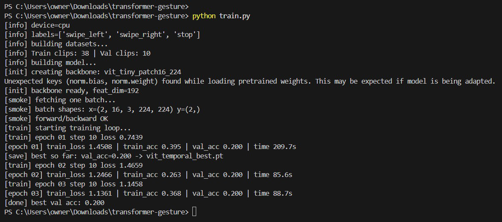
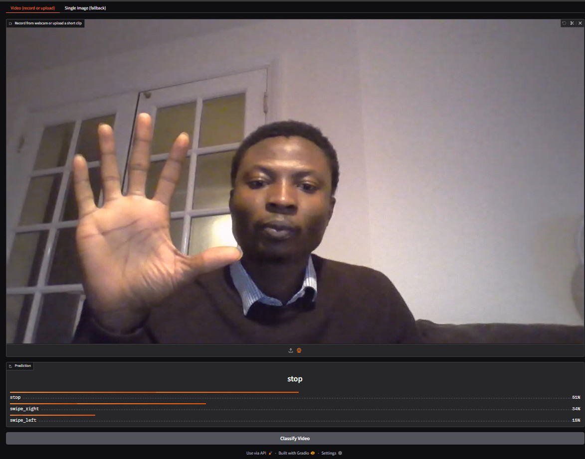
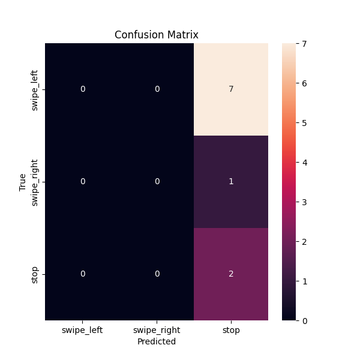

# Transformer Gesture Recognition 🎥➡️🤖  

This project shows how to build a **Transformer-based gesture recognition system** using PyTorch, ONNX, and Gradio. You’ll train on a small dataset, export to ONNX for faster inference, and run a real-time demo app.  

---

## Project Structure  

```
transformer-gesture/
│
├── data/                # Put your gesture videos here
│   ├── swipe_left/
│   ├── swipe_right/
│   └── stop/
│
├── images/              # Screenshots for tutorial & README
│   ├── training-logs.png
│   ├── confusion-matrix.png
│   └── realtime-demo.png
│
├── labels.txt           # One class name per line (matches folders in data/)
├── dataset.py           # Dataset loader
├── train.py             # Training script
├── export_onnx.py       # Export trained model to ONNX
├── app.py               # Gradio demo app (upload/record gestures)
├── eval.py              # Evaluate accuracy + confusion matrix
├── benchmark.py         # Measure inference latency
├── requirements.txt     # Dependencies
└── README.md            # This file
```

---

## Setup  

1. Clone this repo and create a virtual environment:  
   ```bash
   git clone <your-repo-url>
   cd transformer-gesture
   python -m venv .venv
   source .venv/bin/activate   # (Linux/Mac)
   .venv\Scripts\activate    # (Windows)
   ```

2. Install requirements:  
   ```bash
   pip install -r requirements.txt
   ```

---

## Prepare Data  

Place your gesture videos under `data/<class_name>/`. For example:  

```
data/
├── swipe_left/
│   ├── clip1.mp4
│   └── clip2.mp4
├── swipe_right/
└── stop/
```

Update `labels.txt` so each line matches the folder names:  

```
swipe_left
swipe_right
stop
```

💡 Tip: In the Gradio app, you can also **record clips directly from your webcam**.

---

## Train the Model  

```bash
python train.py
```

This saves the best weights to `vit_temporal_best.pt`.  

Here’s what the training logs look like:  



---

## Export to ONNX  

```bash
python export_onnx.py
```

Generates `vit_temporal.onnx` for fast inference.

---

## Run the Demo App  

```bash
python app.py
```

Open the URL shown in the terminal (default: `http://127.0.0.1:7860`). You can record a short gesture and get predictions like this:  



---

## Evaluate Accuracy  

```bash
python eval.py
```

Prints validation accuracy and displays a confusion matrix heatmap:  



---

## Benchmark Latency  

```bash
python benchmark.py
```

Measures average inference time per clip.

---

## Notes  

- This project is intended as a **tutorial/demo**, not production code.  
- For higher accuracy, expand your dataset or use a stronger video Transformer like **TimeSformer** or **VideoMAE**.  
- Always consider **accessibility, fairness, and ethical use** when deploying gesture/speech models.  
